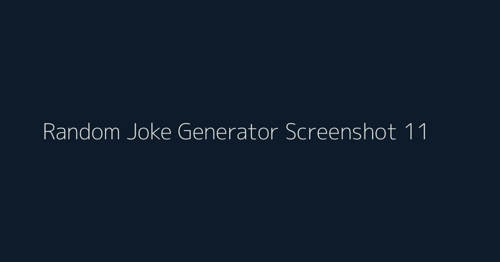

# Random Joke Generator

A polished React + Vite project that fetches and displays random jokes from a live public API.

## Overview

Random Joke Generator is a lightweight frontend app built to practice React state management, API handling, and clean component structure.

## Features

- Fetches a new joke instantly using a button click
- Displays both setup and punchline clearly
- Uses functional React components with hooks
- Simple and responsive interface

## Tech Stack

- React 19
- Vite 7
- JavaScript (ES Modules)
- CSS
- Formik (included in project dependencies)

## API Used

- Endpoint: https://official-joke-api.appspot.com/random_joke

## Getting Started

1. Clone the repository

	git clone <your-repo-url>

2. Open the project folder

	cd Random-Joke-Generator-Using-ReactJs-main

3. Install dependencies

	npm install

4. Start development server

	npm run dev

5. Create production build

	npm run build

6. Preview production build

	npm run preview

## Screenshot - 11

Add your screenshot file and keep its name as 11 for easy reference.

Suggested file path:

public/11.png

Markdown image usage:

## Project Structure

src/
- App.jsx
- Joker.jsx
- main.jsx
- App.css
- index.css

## Future Improvements

- Add loading and error states for API calls
- Add joke categories and filters
- Add copy-to-clipboard and share buttons

## License

This project is for learning and practice purposes.

